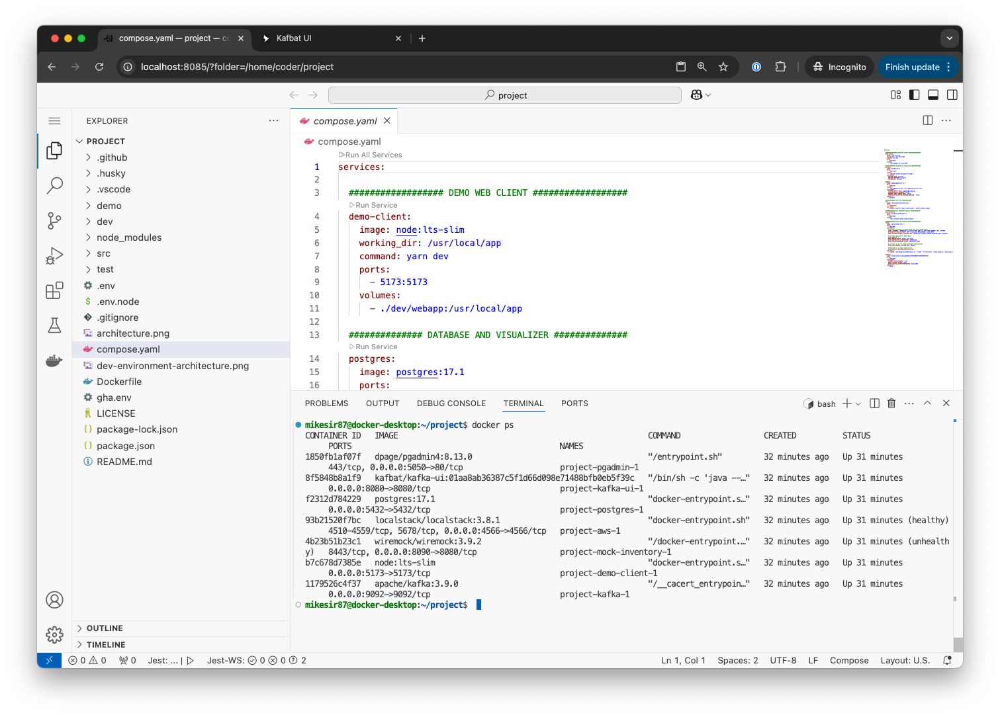
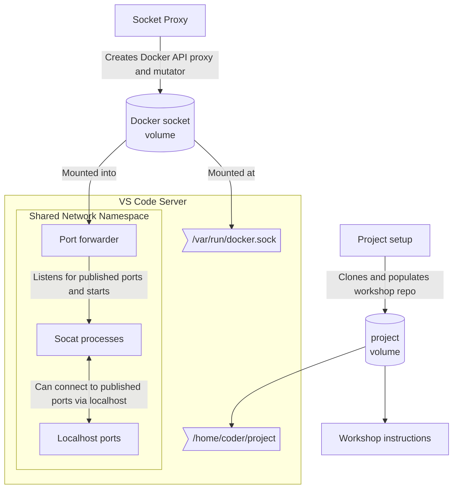

# Workshop PoC

This is only a PoC that demonstrates how one might be able to launch a workshop using containers in a multi-tenant fashion.



## Architecture

The project uses a combination of containers to create an isolated environment.



- **VS Code Server** - utilizes the [coder/code-server](https://github.com/coder/code-server) project to provide VS Code in a browser
- **Setup container** - clones the repo and puts it into a volume that is then shared with the VS Code server.
- **[Docker Socket Proxy](https://github.com/mikesir87/docker-socket-proxy)** - wraps the Docker Socket to put various protections/remappings in place. Specifically:
  - Docker commands will only return the items created by this environment (newly created items are mutated with a label and object responses filter on that label)
  - Mounts in new containers are only allowed from within the project
  - Mount source paths are remapped to the volume the files are found in (even if using relative paths)
  - Requests to start a new container with the Docker socket will be remapped to use the proxied socket. This ensures Testcontainers config also uses the remapping, etc.
- **Host Port Forwarder** - this container runs in the same network namespace as the VS Code Server and watches for container start/stop events that have published ports. It then starts socat processes to allow the forwarding of localhost ports to the container.
    - Example: start a postgres container in the IDE terminal, publishing the port. With this, you can then connect to it using `psql -h localhost` without using host network mode (which isn't always available)
- **Instructions** - a small markdown rendering server that renders the contents of the `docs` directory within a workshop repo

## Known limitations

- Running multiple instances will cause port conflicts
- Volume names are currently hard-coded in the Compose file (for remapping/allowlisting of mount sources)

## Try it out

To try it out, you'll first start off by launching the workshop environment. After that, you can try a few things in the workshop environment.

### Start the workshop stack

1. Clone this project

2. Start the stack using Docker Compose

    ```console
    docker compose -f compose.yaml up -d
    ```

3. Open http://localhost:8085. When you're prompted for the password, simply enter `password`.


### Test out the workshop environment

1. Once you're in VS Code, open a terminal (Menu -> Terminal -> New Terminal)

2. In the terminal, run a `docker ps`. Notice how you see no other containers, even though there are other containers running on the machine (run the same `docker ps` in another terminal directly on your machine)!

3. Start the application stack by launching Docker Compose:

    ```console
    docker compose up -d
    ````

    You'll see all of the containers start up successfully!

4. Run another `docker ps` and you'll see the containers you started!

5. Try out Testcontainers by running the following command:

    ```console
    npm run integration-test
    ```

### Experiment - volume remapping

1. In the VS Code terminal, start another container and mount the `dev/db` directory into the container:

    ```console
    docker run --rm -tiv ./dev/db:/data --name=data-demo ubuntu
    ```

2. In that newly launched container, run `ls /data` and see the file that's there! 

    ```console
    root@a8f1776a6069:/# ls /data
    1-create-schema.sql
    ```

3. On your host machine, run the following command to look at the mount source:

    ```console
    docker inspect --format='{{range .Mounts}}{{println .Type .Name .Source .Destination}}{{end}}' data-demo
    ```

    What you'll see is this is _not_ a bind mount (as the `./dev/db` argument in the `docker run` command would suggest). Instead, it is a mount to the volume named `project`!

4. Exit the container now by running `exit` (in the VS Code terminal).

### Experiment - Docker Socket remapping

1. Start a new container and share the Docker socket:

    ```console
    docker run --rm -tiv /var/run/docker.sock:/var/run/docker.sock --name=socket-demo docker sh
    ```

2. In the new container, run `docker ps`. You should only see the containers created since you started the workshop environment!

3. Run the following command to inspect the container and see where the Docker Socket is coming from:

    ```console
    docker inspect --format='{{range .Mounts}}{{println .Type .Name .Source .Destination}}{{end}}' socket-demo
    ```

    In the output, you should see an entry for:

    ```
    volume socket-proxy /var/lib/docker/volumes/socket-proxy/_data /var/run/docker.sock
    ```

    The socket is coming from the Docker Socket proxy... meaning this nested container is _also_ being proxied!
